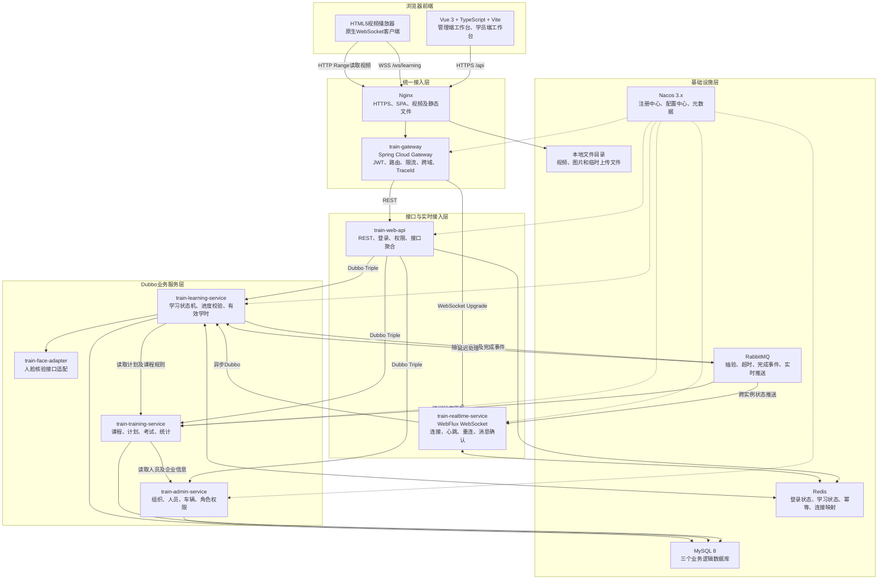
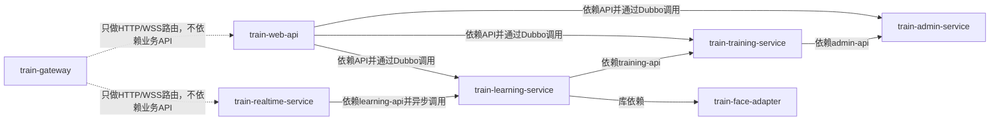
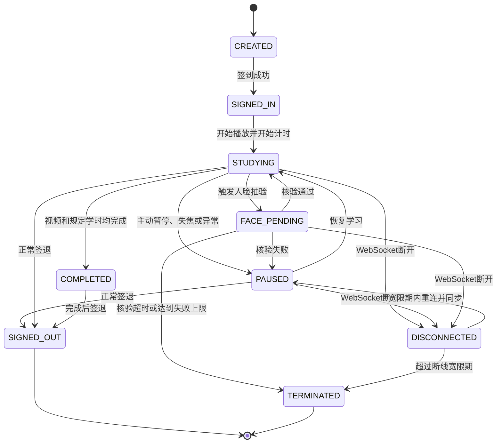
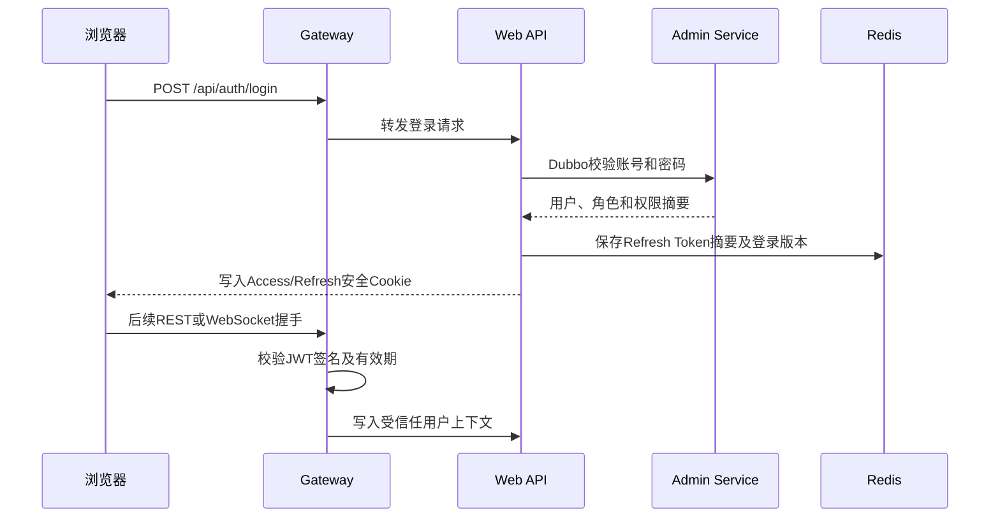

# 道路运输企业在线安全培训与学时监管系统项目总体说明

> 文档版本：1.0
> 编写日期：2026-07-29
> 建议仓库名称：`road-transport-training-platform`
> 建议论文题目：《基于Dubbo微服务架构的道路运输企业在线安全培训与学时监管系统设计与实现》

> 当前实施进度请查看：[IMPLEMENTATION_STATUS.md](./IMPLEMENTATION_STATUS.md)

## 当前仓库状态与快速开始

当前仓库已经完成阶段一的工程骨架初始化，尚未实现业务代码。已建立后端Maven多模块、Vue 3前端、Docker Compose基础设施、数据库初始化、CI和项目文档目录。

环境要求：

- JDK 17；
- Maven 3.8.6或更高版本；
- Node.js 22 LTS；
- pnpm 11.9.0；
- Docker Desktop及Docker Compose，用于启动基础设施。

首次使用：

```powershell
# 1. 准备本地环境变量并替换示例密码
Copy-Item .env.example .env

# 2. 启动MySQL、Redis、RabbitMQ、Nacos和Nginx
.\scripts\start-infra.ps1

# 3. 验证后端Maven模块
mvn -f backend\pom.xml clean verify

# 4. 安装并启动前端
pnpm --dir frontend install
pnpm --dir frontend dev
```

说明：

- 根目录`.env`不会被Git跟踪；
- 前端首次安装成功后需要提交生成的`frontend/pnpm-lock.yaml`；
- 当前Docker Compose不构建Java业务容器，Java应用通过IDE或Maven独立运行；
- 当前Nginx只提供健康检查、Gateway反向代理和媒体目录占位，前端生产产物将在后续阶段接入；
- 本地Nacos采用单机开发配置，不能直接作为生产配置使用。

## 1. 文档目的

本文档用于指导“道路运输企业在线安全培训与学时监管系统”的项目初始化、代码组织、模块开发、环境部署和论文撰写。

项目是基于本人对道路运输在线培训业务的理解重新设计和实现的本科论文精简版系统，不复制既有商业项目的源代码、SQL、XML、配置、页面、截图、测试数据或专有资源。系统将保留在线培训领域具有代表性的业务流程和技术问题，并使用新的技术框架、工程结构、数据模型、接口协议和页面设计独立实现。

本文档后续可作为新Git仓库的顶层说明文档使用。在项目完成初始化后，可根据实际实现情况继续补充启动命令、环境变量、接口地址、演示账号和页面截图。

## 2. 项目定位

### 2.1 建设目标

系统面向道路运输企业的在线安全培训场景，提供从培训任务下达到学习结果确认的完整闭环：

```text
组织及人员管理
    -> 课程和培训计划
    -> 学员在线视频学习
    -> 实时进度与有效学时监管
    -> 学习过程人脸抽验
    -> 在线考试
    -> 培训完成确认
    -> 培训结果统计
```

项目重点不是实现一个普通的视频播放网站，而是解决以下问题：

1. 如何在浏览器与服务端之间持续同步学习状态。
2. 如何处理进度重复上报、乱序、旧学习记录和多设备登录。
3. 如何在暂停、页面失焦、网络中断和重新连接时保证学时状态一致。
4. 如何由服务端确认有效学习时长，避免直接信任客户端声明的播放时间。
5. 如何将人脸抽验结果与学习状态关联。
6. 如何把培训计划、课程学习、考试和培训完成状态连接为完整闭环。

### 2.2 项目类型

本项目采用前后端分离、微服务和事件驱动相结合的架构：

- 前端为一个Vue单页应用；
- 前端内部划分管理端工作台和学员端工作台；
- 后端采用Spring Boot和Dubbo构建多个服务；
- HTTP和WebSocket统一经过网关；
- Dubbo服务通过Nacos完成注册和发现；
- MySQL是最终持久化数据源；
- Redis保存短期状态、缓存及幂等信息；
- RabbitMQ处理延迟任务和跨服务异步事件。

### 2.3 论文精简版边界

本项目需要实现：

- 企业、部门、人员、车辆、角色和权限；
- 课程、课件和培训计划；
- 培训计划与学员关联；
- 学员登录和统一工作台入口；
- 视频播放、签到、暂停、恢复和签退；
- 学习进度上报和有效学时累计；
- 重复消息、断线重连和旧学习记录隔离；
- 一种可演示的人脸抽验流程；
- 简化的题库、试卷、考试和自动判分；
- 学习记录、考试结果和培训完成情况统计；
- Docker Compose本地部署；
- 与论文相关的功能、异常和性能测试。

本项目暂不实现：

- App、微信小程序等其他客户端；
- 收费、订单、合同和企业结算；
- 对接政府监管平台；
- 数据库分库分表和多数据源；
- 工作流引擎；
- 分布式事务框架；
- Kubernetes和服务网格；
- 自研人脸识别算法；
- 复杂的直播教学和互动课堂；
- 大规模文件转码和内容分发网络；
- 商业系统中的全部历史兼容逻辑。

## 3. 用户角色与工作台

### 3.1 系统角色

系统至少包含以下角色：

| 角色 | 主要职责 |
|---|---|
| 系统管理员 | 初始化企业、角色、权限和系统参数 |
| 企业管理员 | 管理本企业组织、人员、车辆和账号 |
| 培训管理员 | 管理课程、培训计划、参训人员、考试和统计 |
| 学员 | 查看培训任务、参加视频学习、人脸抽验和考试 |

论文精简版可以由同一个用户同时拥有多个角色。前端根据当前角色加载对应菜单，具备管理权限的用户可以在管理端和学员端工作台之间切换。

### 3.2 一个前端、两个工作台

最终只交付一个Vue前端工程和一个登录入口，内部划分两个业务区域：

```text
/login                         统一登录

/admin                         管理端工作台
├─ /admin/dashboard            管理首页
├─ /admin/org                  组织管理
├─ /admin/user                 人员管理
├─ /admin/vehicle              车辆管理
├─ /admin/course               课程及课件
├─ /admin/plan                 培训计划
├─ /admin/exam                 题库、试卷及考试
└─ /admin/statistics           培训统计

/student                       学员端工作台
├─ /student/home               学员首页
├─ /student/plans              我的培训任务
├─ /student/plan/:id           培训详情
├─ /student/study/:id          视频学习
├─ /student/exam/:id           在线考试
└─ /student/records            学习及培训记录
```

采用一个前端工程的原因：

- 登录、用户信息和权限代码可以复用；
- 管理端和学员端可以共享接口请求、字典、文件预览等基础能力；
- 不需要维护两套构建和部署流程；
- 适合个人完成的本科论文项目；
- 可以通过路由懒加载控制最终资源体积；
- 后续如果确实需要，也可以按现有模块边界拆成两个前端工程。

## 4. 总体技术架构

### 4.1 总体架构图



### 4.2 网络调用边界

| 调用场景 | 通信方式 |
|---|---|
| 浏览器请求普通业务接口 | HTTPS REST |
| 浏览器上报实时学习动作 | WSS WebSocket |
| 网关转发HTTP接口 | HTTP |
| 网关转发WebSocket握手 | WebSocket Upgrade |
| BFF调用业务服务 | Dubbo Triple |
| 实时服务调用学时服务 | 异步Dubbo Triple |
| 服务间延迟任务和状态事件 | RabbitMQ |
| 服务发现和配置加载 | Nacos |

以下规则必须遵守：

1. 浏览器不能直接访问Dubbo服务。
2. Gateway只负责接入、鉴权和路由，不编写培训业务。
3. Gateway不直接调用Dubbo接口。
4. REST接口统一由`train-web-api`对前端提供。
5. WebSocket连接统一由`train-realtime-service`维护。
6. 实时服务不直接编写学时业务规则，业务判断由`train-learning-service`完成。
7. 服务之间禁止依赖其他服务的实现模块。
8. 跨服务调用只能使用对应的API模块、Dubbo接口或RabbitMQ事件。

## 5. 技术选型

### 5.1 后端技术

| 类别 | 技术 | 建议版本或分支 | 用途 |
|---|---|---|---|
| 运行环境 | JDK | 17 | 后端统一Java版本 |
| 应用框架 | Spring Boot | 3.5.x，初始化时选择最新兼容补丁 | 应用启动、依赖管理和自动配置 |
| RPC | Apache Dubbo | 3.3.x，初始化建议从3.3.6验证 | 服务间调用 |
| RPC协议 | Dubbo Triple | Dubbo管理版本 | HTTP/2风格的服务通信 |
| 微服务体系 | Spring Cloud | 2025.0.x | Gateway及服务发现基础 |
| 微服务体系 | Spring Cloud Alibaba | 2025.0.x | Nacos集成 |
| 注册及配置 | Nacos Server | 3.x | 注册、配置和元数据 |
| 网关 | Spring Cloud Gateway WebFlux | 由Spring Cloud BOM管理 | HTTP及WebSocket接入 |
| 实时通信 | Spring WebFlux WebSocket | 由Spring Boot管理 | 标准WebSocket服务 |
| 网络运行时 | Reactor Netty | 由Spring Boot管理 | 非阻塞长连接 |
| 安全 | Spring Security | 由Spring Boot管理 | 认证和授权 |
| 会话 | JWT + Redis Refresh Token | 自行实现 | 登录和跨模块身份传递 |
| 数据库 | MySQL | 8.4 LTS或兼容MySQL 8版本 | 最终持久化 |
| ORM | MyBatis-Flex | 使用稳定版本 | 数据访问 |
| 数据库迁移 | Flyway | 由Spring Boot兼容版本管理 | 建表和版本变更 |
| 缓存 | Redis | 7.x或兼容版本 | 缓存、状态和幂等 |
| 消息 | RabbitMQ | 4.x或兼容版本 | 异步和延迟事件 |
| 接口文档 | springdoc-openapi | 2.x | OpenAPI和Swagger UI |
| 对象转换 | MapStruct | 稳定版本 | Entity、DTO和VO转换 |
| 参数校验 | Jakarta Validation | 由Spring Boot管理 | REST及RPC入参校验 |
| 监控 | Actuator + Micrometer | 由Spring Boot管理 | 健康检查和指标 |
| 日志 | SLF4J + Logback | 由Spring Boot管理 | 结构化日志 |
| 测试 | JUnit 5、Mockito、Testcontainers | 稳定版本 | 单元和集成测试 |

版本管理要求：

- 根Maven工程统一导入Spring Boot、Spring Cloud、Spring Cloud Alibaba和Dubbo BOM；
- 子模块禁止单独指定上述框架的版本；
- Gateway和Dubbo服务可能通过不同Starter引入Nacos Client，初始化时必须检查依赖树并统一版本；
- 升级版本时先修改依赖管理模块，再执行全部测试；
- 不使用`bootstrap.yml`，Nacos配置使用`spring.config.import`方式导入。

截至本文编写日期，Spring Boot 3.5.x要求至少使用Java 17；Spring Cloud 2025.0.x与Spring Boot 3.5.x对应；Spring Cloud Alibaba 2025.0.x同样适配该组合。Dubbo 3.3.x支持JDK 17和Spring Boot 3.x。Nacos 3.x服务端兼容2.x及3.x客户端，因此可在BOM统一Nacos Client版本后供Spring Cloud与Dubbo共同使用。初始化时仍需以实际Maven依赖树和最小联通测试作为最终依据。

官方参考：

- Spring Boot系统要求：<https://docs.spring.io/spring-boot/3.5/system-requirements.html>
- Spring Cloud支持版本：<https://github.com/spring-cloud/spring-cloud-release/wiki/Supported-Versions>
- Dubbo Spring Boot：<https://dubbo.apache.org/en/overview/mannual/java-sdk/reference-manual/config/spring/spring-boot/>
- Dubbo Nacos注册中心：<https://dubbo.apache.org/en/overview/mannual/java-sdk/reference-manual/registry/nacos/>
- Spring Cloud Alibaba版本说明：<https://sca.aliyun.com/docs/2025.x/overview/version-explain/>
- Nacos 3.x客户端兼容性：<https://nacos.io/docs/latest/manual/admin/upgrading/>
- WebFlux WebSocket：<https://docs.spring.io/spring/reference/web/webflux-websocket.html>

### 5.2 前端技术

| 类别 | 技术 | 用途 |
|---|---|---|
| 框架 | Vue 3 | 单页应用 |
| 开发语言 | TypeScript | 类型约束和可维护性 |
| 构建工具 | Vite | 开发服务器和生产构建 |
| 包管理 | pnpm | 前端依赖管理 |
| 路由 | Vue Router | 管理端和学员端路由 |
| 状态 | Pinia | 登录、权限和学习状态 |
| HTTP | Axios | REST请求 |
| UI | Element Plus | 管理端及通用组件 |
| 图表 | ECharts | 培训统计 |
| 视频 | HTML5 `<video>` | 视频播放 |
| 实时通信 | 浏览器原生WebSocket | 学习动作和服务端推送 |
| 测试 | Vitest | 单元测试 |
| 端到端测试 | Playwright | 核心页面流程测试 |
| 代码规范 | ESLint + Prettier | 静态检查和格式统一 |

前端是独立的Node.js工程：

- 使用`package.json`和`pnpm-lock.yaml`管理；
- 不加入Maven的`modules`；
- 开发阶段通过`pnpm dev`独立启动；
- 生产阶段通过`pnpm build`生成`dist`；
- `dist`由Nginx部署；
- Maven不负责安装和构建前端依赖；
- Docker Compose或顶层脚本可以统一编排前后端。

### 5.3 关键技术决策

| 决策 | 最终选择 | 主要原因 |
|---|---|---|
| 服务注册与配置 | Nacos，不使用ZooKeeper | 同时覆盖Dubbo注册发现、Spring Cloud服务发现和配置管理，论文部署时可以减少基础设施数量 |
| 实时通信 | Spring WebFlux WebSocket + Reactor Netty | 使用标准WebSocket协议，与Spring Boot 3和Gateway集成直接，适合维护大量长连接 |
| 浏览器客户端 | 原生WebSocket，不使用Socket.IO客户端 | 不绑定Socket.IO私有协议，可自行定义精简、可测试的学习消息协议 |
| 登录会话 | JWT Access Token + Redis Refresh Token | 适合Gateway、REST和WebSocket共同鉴权，并支持主动退出和账号禁用 |
| 业务持久化 | MySQL 8，不使用MongoDB | 课程、计划、学习、考试等数据关系明确，事务和约束比文档数据库更符合本项目 |
| 前端组织 | 一个Vue工程、两个工作台 | 复用登录和基础组件，同时保持管理端与学员端业务边界 |
| 仓库组织 | 一个Git Monorepo | 便于个人维护、统一版本和一次性提交论文完整交付物 |
| 实时服务部署 | 同仓库中的独立应用 | 长连接生命周期和普通REST不同，独立进程更容易隔离、重启和扩容 |

本项目不继续使用Socket.IO，主要原因如下：

1. Socket.IO在标准WebSocket之上增加了自己的握手、事件和重连协议，浏览器与服务端都必须使用相互兼容的Socket.IO实现。
2. 本系统只需要连接、心跳、ACK、重连、状态同步和服务端推送，使用标准WebSocket即可覆盖核心需求。
3. WebFlux WebSocket可以直接复用Spring Security、Gateway、Actuator和Reactor Netty，减少额外框架及版本兼容成本。
4. 自定义统一消息信封、序号和状态同步流程，更便于将学时幂等、乱序处理和异常恢复写入论文并进行测试。
5. 标准WebSocket客户端无额外运行时依赖，未来更换前端框架或增加其他标准客户端时迁移成本更低。

Socket.IO自带房间、事件确认和自动重连，适合强调快速开发的实时聊天类项目。本项目选择标准WebSocket后，需要自行实现重连退避、ACK、心跳、连接映射和状态恢复，这些能力由`frontend/src/realtime`与`train-realtime-service`共同承担。

## 6. Git仓库总体目录

```text
road-transport-training-platform/
├─ README.md
├─ LICENSE                         是否开源后再决定
├─ .gitignore
├─ .editorconfig
├─ .env.example
│
├─ backend/                        后端Maven多模块工程
│  ├─ pom.xml
│  │
│  ├─ train-dependencies/          依赖版本管理
│  │  └─ pom.xml
│  │
│  ├─ train-common/
│  │  ├─ pom.xml                   公共模块聚合POM
│  │  ├─ train-common-core/        Result、异常、常量、工具类
│  │  ├─ train-common-security/    JWT、用户上下文、权限对象
│  │  ├─ train-common-dubbo/       Dubbo Filter、RPC上下文
│  │  └─ train-common-test/        公共测试工具
│  │
│  ├─ train-api/
│  │  ├─ pom.xml                   RPC API聚合POM
│  │  ├─ train-admin-api/          管理服务RPC接口和DTO
│  │  ├─ train-training-api/       课程、计划、考试RPC接口和DTO
│  │  └─ train-learning-api/       学习及学时RPC接口和DTO
│  │
│  ├─ train-gateway/               网关，可独立运行
│  ├─ train-web-api/               REST/BFF，可独立运行
│  ├─ train-realtime-service/      WebSocket，可独立运行
│  ├─ train-admin-service/         管理服务，可独立运行
│  ├─ train-training-service/      培训服务，可独立运行
│  ├─ train-learning-service/      学习服务，可独立运行
│  └─ train-face-adapter/          人脸适配库，初期不独立运行
│
├─ frontend/                       独立Vue工程
│  ├─ package.json
│  ├─ pnpm-lock.yaml
│  ├─ vite.config.ts
│  ├─ tsconfig.json
│  ├─ index.html
│  ├─ public/
│  └─ src/
│     ├─ api/
│     │  ├─ admin/
│     │  ├─ student/
│     │  └─ common/
│     ├─ assets/
│     ├─ components/
│     ├─ composables/
│     ├─ layouts/
│     │  ├─ AdminLayout.vue
│     │  └─ StudentLayout.vue
│     ├─ router/
│     ├─ stores/
│     ├─ realtime/
│     ├─ utils/
│     └─ views/
│        ├─ admin/
│        └─ student/
│
├─ database/
│  ├─ README.md                    数据所有权和迁移说明
│  ├─ seed/                        跨模块演示数据，仅演示环境执行
│  └─ design/                      ER图和数据字典
│
├─ deploy/
│  ├─ docker-compose.yml
│  ├─ nginx/
│  ├─ nacos/
│  ├─ mysql/
│  │  └─ init/                      创建逻辑数据库和最小权限账号
│  ├─ redis/
│  └─ rabbitmq/
│
├─ docs/
│  ├─ architecture/                架构和时序图
│  ├─ api/                         REST、Dubbo和WebSocket协议
│  ├─ requirements/                用例和需求
│  ├─ test/                        测试计划及结果
│  └─ thesis/                      论文相关材料
│
├─ scripts/
│  ├─ start-infra.ps1
│  ├─ stop-infra.ps1
│  └─ build.ps1
│
└─ .github/
   └─ workflows/
      ├─ backend-ci.yml
      └─ frontend-ci.yml
```

## 7. Maven模块职责

后端包含六个独立可运行应用：

| 可运行应用 | 是否对浏览器提供服务 | 部署方式 |
|---|---:|---|
| `train-gateway` | 是，统一外部入口 | 独立JVM或容器 |
| `train-web-api` | 间接，通过Gateway | 独立JVM或容器 |
| `train-realtime-service` | 间接，通过Gateway | 独立JVM或容器 |
| `train-admin-service` | 否，只提供Dubbo服务 | 独立JVM或容器 |
| `train-training-service` | 否，只提供Dubbo服务 | 独立JVM或容器 |
| `train-learning-service` | 否，只提供Dubbo服务 | 独立JVM或容器 |

其余模块均为Maven父工程、BOM或普通JAR，不应创建无意义的启动类。论文演示环境可以在一台计算机上运行全部应用，但每个应用仍保持独立启动和停止能力。

### 7.1 `train-dependencies`

职责：

- 集中声明所有后端依赖版本；
- 导入Spring Boot、Spring Cloud、Spring Cloud Alibaba和Dubbo BOM；
- 管理MyBatis-Flex、MapStruct、springdoc-openapi和测试依赖；
- 避免子模块出现不同版本的同一组件。

该模块不包含业务代码。

### 7.2 `train-common-core`

职责：

- 统一返回对象`Result<T>`；
- 错误码和业务异常；
- 分页请求及分页返回；
- 时间、ID和通用校验工具；
- 跨模块共用的少量枚举。

限制：

- 不能依赖业务服务；
- 不能放置具体业务实体；
- 不能逐渐演变成包含所有代码的“大公共模块”。

### 7.3 `train-common-security`

职责：

- JWT签发和验证基础能力；
- 登录用户对象；
- 权限和角色模型；
- 用户上下文；
- 网关及BFF共用的安全常量；
- Redis刷新令牌的数据结构。

私钥只能配置在签发令牌的模块中。Gateway和实时服务只持有JWT公钥。

### 7.4 `train-common-dubbo`

职责：

- Dubbo消费者及提供者公共配置；
- TraceId和用户上下文传递Filter；
- RPC异常统一转换；
- RPC调用日志和超时规范。

从浏览器传入的用户头必须由Gateway删除，只有受信任的BFF或实时服务才能写入内部RPC上下文。

`train-common-test`只保存测试数据构造器、测试基类和Testcontainers公共支持，只能以`test`作用域被其他模块引用，不能进入生产运行依赖。

### 7.5 `train-*-api`

职责：

- 定义Dubbo接口；
- 定义RPC请求和响应DTO；
- 定义跨服务使用的事件数据结构；
- 对外接口返回值统一使用`Result<T>`；
- 无返回数据的RPC接口使用`Result<?>`。

限制：

- 不包含Mapper；
- 不包含数据库实体；
- 不包含服务实现；
- API模块之间原则上不相互依赖；
- DTO字段应稳定、明确，避免直接暴露数据库表结构。

### 7.6 `train-gateway`

职责：

- 系统统一访问入口；
- `/api/**`路由到`train-web-api`；
- `/ws/**`路由到`train-realtime-service`；
- JWT签名、有效期和基础权限校验；
- 跨域、Origin和安全响应头；
- 请求限流；
- TraceId生成；
- 移除外部伪造的内部用户请求头；
- Nacos HTTP服务发现；
- 健康检查。

不负责：

- 用户密码校验；
- 培训计划业务；
- 学时计算；
- 数据库访问；
- Dubbo业务调用。

### 7.7 `train-web-api`

职责：

- 为唯一的Web前端提供REST接口；
- 提供登录、刷新令牌和退出接口；
- 调用管理服务校验用户账号；
- 将Dubbo服务结果转换为前端VO；
- 聚合计划、学时、考试等多个服务的数据；
- 文件上传入口；
- OpenAPI文档；
- 业务级权限校验；
- 当前用户和组织范围解析。

该模块是BFF，不拥有核心业务表，不应重复实现业务服务中的规则。

### 7.8 `train-realtime-service`

职责：

- 提供标准WebSocket端点；
- WebSocket握手JWT校验；
- 校验请求Origin；
- 维护用户、学习记录和连接的绑定关系；
- 心跳和连接超时；
- 解析统一实时消息；
- 校验消息大小和基本字段；
- 向前端返回ACK；
- 断线和重连处理；
- 通过异步Dubbo调用学时服务；
- 订阅RabbitMQ推送事件并定位连接；
- 在Redis中保存跨实例连接映射。

不负责：

- 直接修改学习业务表；
- 判断课程是否完成；
- 计算最终有效学时；
- 实现人脸识别；
- 保存客户端每次心跳。

该模块是独立可运行进程，但与其他模块保存在同一个Git仓库。论文环境只部署一个实例，架构上保留以后水平扩容的能力。

### 7.9 `train-admin-service`

负责以下领域：

- 企业和部门；
- 学员和管理员账号；
- 从业人员基础信息；
- 车辆基础信息；
- 角色、权限和用户角色；
- 账号启用、禁用；
- 密码验证；
- 用户数据范围；
- 基础字典。

典型接口：

- 用户登录信息查询；
- 根据用户ID查询权限；
- 组织树查询；
- 人员分页；
- 车辆分页；
- 角色授权；
- 校验用户是否属于企业。

### 7.10 `train-training-service`

负责以下领域：

- 课程；
- 视频课件元数据；
- 培训计划；
- 培训计划课程；
- 培训计划学员；
- 计划发布和取消；
- 题库；
- 试卷；
- 考试记录和答案；
- 客观题自动判分；
- 培训完成状态；
- 管理端统计。

服务边界：

- 只保存视频文件的元数据和访问路径，不通过Java服务传输大视频；
- 学习过程中产生的会话和进度归学习服务管理；
- 培训服务消费“学习完成”和“考试完成”事件，综合判断培训是否完成；
- 统计只实现论文所需的计划数、参训人数、完成人数、完成率、平均学时和考试结果。

### 7.11 `train-learning-service`

这是论文的核心业务服务，负责：

- 创建学习会话；
- 签到、开始学习、暂停、恢复和签退；
- 处理视频进度上报；
- 维护学习状态机；
- 处理重复、乱序和旧学习记录消息；
- 控制是否允许拖动；
- 校验进度上报间隔和允许误差；
- 累计有效学习时长；
- 断线宽限和超时；
- 同一用户单设备学习限制；
- 生成随机人脸抽验任务；
- 处理人脸抽验结果；
- 判断课程学习完成；
- 发布学习完成事件；
- 保存关键学习事件日志；
- 管理MQ Outbox。

学习服务使用：

- MySQL保存最终学习记录；
- Redis保存当前会话和短周期实时状态；
- RabbitMQ处理延迟抽验、断线超时和完成事件；
- Dubbo读取培训计划和课程规则；
- 人脸适配模块完成照片核验。

### 7.12 `train-face-adapter`

职责：

- 定义统一的`FaceVerifier`接口；
- 封装第三方服务或本地模拟实现；
- 输入登记照片和当前照片；
- 返回是否通过、相似度、原因和处理耗时；
- 对业务层隐藏具体厂商SDK。

论文中应将其描述为“人脸核验服务集成”，不描述为自研人脸识别算法。

第一阶段可以提供可替换的模拟实现：

- 预设测试账号与照片；
- 返回可控的通过或失败结果；
- 用于演示抽验流程；
- 后续再接入合法授权的第三方服务。

### 7.13 模块依赖规则

模块之间的代码依赖和运行时调用关系必须保持单向：



强制约束：

1. `*-api`模块不能依赖对应的`*-service`实现模块。
2. 服务实现模块不能直接依赖其他服务的实现模块。
3. 业务服务不能引用其他服务的Mapper、Entity或数据库连接。
4. 同步跨服务查询使用Dubbo，最终状态通知和延迟任务使用RabbitMQ。
5. `train-training-service`不能同步反向调用`train-learning-service`，学习完成结果通过事件通知，避免循环依赖。
6. Gateway不能直接调用Dubbo，也不能访问业务数据库。
7. BFF和实时服务不能直接访问业务表。
8. `train-common-*`只能保存真正跨模块稳定复用的能力，不能放置具体培训业务。

## 8. 后端服务内部目录规范

每个业务服务采用相同的分层方式：

```text
me.lj.train.<domain>/
├─ Application.java
├─ config/                 Spring、Dubbo、Redis及MQ配置
├─ service/                Dubbo服务实现
├─ biz/                    业务编排和核心规则
├─ mapper/                 MyBatis-Flex Mapper
├─ model/
│  ├─ entity/              数据库实体
│  ├─ dto/                 服务内部DTO
│  ├─ command/             写操作命令
│  └─ query/               查询条件
├─ mq/
│  ├─ producer/
│  ├─ consumer/
│  └─ event/
├─ schedule/               补偿和定时任务
├─ converter/              MapStruct转换器
├─ constant/
├─ enums/
└─ support/                领域内辅助代码
```

推荐调用链：

```text
Dubbo Service
    -> Biz
    -> Mapper
    -> MySQL
```

约束：

- `service`层只负责接口适配、权限入口和事务边界；
- `biz`层负责核心业务和状态转换；
- `mapper`层只负责数据访问；
- 简单查询可以由Biz直接调用Mapper；
- 禁止Service调用其他服务的Mapper；
- 禁止跨服务直接查询其他模块的数据表；
- 业务状态使用枚举，不使用无含义魔法数字；
- 时间字段使用`LocalDateTime`；
- 数据库时间类型统一使用`DATETIME(3)`；
- 全系统时区统一为`Asia/Shanghai`；
- 代码和数据库注释使用中文；
- 文件统一使用无BOM UTF-8。

## 9. 前端职责与目录

### 9.1 前端负责

- 页面展示和交互；
- 路由和工作台切换；
- 调用REST接口；
- 管理登录状态；
- 建立及恢复WebSocket连接；
- 播放视频；
- 采集当前播放位置和页面状态；
- 展示服务端确认进度；
- 展示人脸抽验弹窗；
- 使用HTTP上传抽验照片；
- 展示考试和统计结果。

### 9.2 前端不负责

- 最终有效学时计算；
- 判断消息是否属于旧学习记录；
- 决定课程是否完成；
- 决定人脸抽验是否通过；
- 决定培训是否完成；
- 仅通过隐藏按钮实现权限控制；
- 在本地存储敏感身份信息。

服务端是学习状态和有效学时的最终权威。前端视频播放时间只作为学习事件的一部分上报。

### 9.3 前端核心模块

```text
src/
├─ api/
│  ├─ auth.ts
│  ├─ admin/
│  ├─ training/
│  ├─ learning/
│  └─ exam/
├─ components/
│  ├─ AppTable/
│  ├─ AppDialog/
│  ├─ PermissionButton/
│  └─ VideoStudyPlayer/
├─ composables/
│  ├─ useAuth.ts
│  ├─ usePermission.ts
│  ├─ useStudySession.ts
│  └─ useWebSocket.ts
├─ layouts/
│  ├─ AdminLayout.vue
│  └─ StudentLayout.vue
├─ realtime/
│  ├─ client.ts
│  ├─ protocol.ts
│  ├─ reconnect.ts
│  └─ handlers.ts
├─ router/
│  ├─ index.ts
│  ├─ admin.ts
│  └─ student.ts
├─ stores/
│  ├─ auth.ts
│  ├─ permission.ts
│  ├─ app.ts
│  └─ learning.ts
└─ views/
   ├─ admin/
   └─ student/
```

## 10. 核心业务功能

### 10.1 登录与权限

实现内容：

- 用户名和密码登录；
- BCrypt密码校验；
- 签发短期Access Token；
- Redis保存Refresh Token摘要和用户登录版本；
- 刷新令牌轮换；
- 主动退出；
- 用户禁用后拒绝刷新；
- Gateway校验JWT；
- BFF校验菜单及数据权限；
- WebSocket握手校验JWT；
- 前端根据权限动态加载路由和菜单。

建议：

- Access Token有效期15至30分钟；
- Refresh Token有效期7天左右；
- 使用RSA私钥签发、公钥验证；
- 浏览器使用`HttpOnly`、`Secure`和`SameSite` Cookie；
- 不将长期令牌存入`localStorage`；
- WebSocket握手携带同域Cookie；
- 对Cookie认证接口启用合适的CSRF保护；
- 开发环境通过Vite代理保持同源。

### 10.2 基础管理

企业管理员可以：

- 创建和维护企业部门；
- 新增、编辑和禁用人员；
- 维护人员与部门关系；
- 维护车辆基础信息；
- 创建角色；
- 为角色分配菜单和功能权限；
- 为用户分配角色；
- 查看人员参加培训的基本情况。

### 10.3 课程及课件

培训管理员可以：

- 创建课程；
- 设置课程名称、简介、封面和规定学时；
- 关联一个或多个视频课件；
- 配置视频顺序；
- 配置是否允许拖动；
- 配置进度上报间隔；
- 配置学时允许误差；
- 启用或禁用课程。

视频文件不经过Dubbo和Gateway传输。论文环境下由Nginx通过HTTP Range提供本地MP4文件，MySQL只保存路径、文件大小、时长、摘要和业务元数据。

### 10.4 培训计划

培训管理员可以：

- 创建培训计划；
- 选择课程；
- 选择参训人员；
- 设置开始和结束时间；
- 配置是否需要考试；
- 配置考试及格分；
- 发布计划；
- 查看各学员学习、考试和完成状态；
- 取消未开始计划。

培训计划发布时，需要保存课程学习规则、规定学时、试卷规则和及格分数等快照。计划发布后的基础课程或试卷即使被修改，也不能影响已经开始的培训任务。

计划状态建议：

```text
DRAFT -> PUBLISHED -> IN_PROGRESS -> FINISHED
                  \-> CANCELLED
```

### 10.5 视频学习与学时

学员可以：

- 查看自己的培训任务；
- 进入培训计划详情；
- 开始课程学习；
- 进行学习签到；
- 播放、暂停和恢复视频；
- 查看服务端确认的学习进度和有效学时；
- 完成人脸抽验；
- 网络恢复后同步当前状态；
- 正常签退；
- 查看历史学习记录。

服务端至少处理：

- 同一个用户只有一个有效学习会话；
- 一个会话只能属于一个用户、计划和课程；
- 每条消息携带唯一请求ID；
- 每条消息携带递增序号；
- 重复请求只返回原处理结果，不重复累计；
- 小于当前序号的事件不修改状态；
- 属于旧学习会话的消息被拒绝；
- 暂停期间不累计有效时长；
- 失焦时根据系统配置暂停；
- 未允许拖动时校验视频进度变化；
- 断线后进入宽限期；
- 宽限期内重连可以恢复；
- 超过宽限期自动暂停或签退；
- 服务端时间是计时依据；
- 最终完成状态由规定学时和视频完成情况共同决定。

单次有效学时增量由服务端按以下思路计算：

```text
有效增量 = min(
    本次与上次有效事件的服务端时间差,
    本次与上次已确认的视频位置差,
    最大允许上报间隔,
    课程剩余可累计时长
)
```

只有当前状态为`STUDYING`，并且连接、心跳、消息顺序、视频位置和人脸抽验状态均通过校验时，计算结果才允许大于零。以下规则应作为核心业务规则编写单元测试：

| 编号 | 业务规则 |
|---|---|
| `BR-01` | 同一用户同一时间只允许一个有效学习会话 |
| `BR-02` | 只有已分配且处于计划有效期内的课程允许学习 |
| `BR-03` | 只有`STUDYING`状态允许累计有效学时 |
| `BR-04` | 前端上报的累计时长不能作为最终学时 |
| `BR-05` | 拖动产生的视频位置差不能直接换算为有效学时 |
| `BR-06` | 抽验等待、失败和超时期间不累计有效学时 |
| `BR-07` | 重复、乱序和旧会话消息不能造成重复计时 |
| `BR-08` | 断线期间不累计有效学时，重连后以服务端状态为准 |
| `BR-09` | 学习和考试均满足计划规则后才能确认培训完成 |
| `BR-10` | 关键状态变化必须保存可追溯的审计记录 |

### 10.6 人脸抽验

实现流程：

1. 学习服务根据计划配置生成抽验任务。
2. RabbitMQ延迟消息在指定时间触发抽验。
3. 实时服务向对应WebSocket连接推送抽验通知。
4. 学员端弹出拍照窗口并暂停或限制有效学时。
5. 照片通过HTTP上传，不通过WebSocket传输大图片。
6. 人脸适配模块完成核验。
7. 核验结果写入`face_check_log`。
8. 通过后恢复学习；失败或超时按规则继续暂停或结束会话。

保存内容：

- 抽验任务ID；
- 用户、计划、课程和学习会话；
- 发起时间、截止时间和响应时间；
- 核验结果；
- 相似度；
- 失败原因；
- 服务耗时；
- 照片文件路径或摘要。

系统不在日志中输出人脸照片Base64或其他敏感内容。

### 10.7 在线考试

论文精简版实现：

- 单选题、判断题；
- 题库管理；
- 手工组卷或随机简单组卷；
- 考试开始和截止时间；
- 学员作答；
- 提交后自动判分；
- 保存答案和成绩；
- 判断是否及格；
- 防止重复提交；
- 考试结果与培训计划关联。

不实现：

- 主观题人工阅卷；
- 复杂防切屏；
- 多次补考策略；
- 大规模随机组卷算法。

### 10.8 培训完成及统计

完成条件：

```text
需要学习且不需要考试：
    学习完成 -> 培训完成

不需要学习且需要考试：
    考试及格 -> 培训完成

同时需要学习和考试：
    学习完成 AND 考试及格 -> 培训完成
```

管理端统计：

- 培训计划数量；
- 参训人数；
- 已开始人数；
- 学习完成人数；
- 考试及格人数；
- 培训完成人数；
- 完成率；
- 学员有效学时；
- 学员培训明细。

## 11. 学习状态机

### 11.1 状态定义



### 11.2 状态转换原则

- 状态转换统一由学习服务执行；
- 前端只能提交事件，不能直接指定服务端状态；
- 每次转换记录转换前状态、事件、转换后状态和服务端时间；
- 非法状态转换返回明确错误码；
- 重复事件应保持幂等；
- 旧会话事件不能修改当前会话；
- 每个状态是否累计有效时长必须明确配置；
- `STUDYING`状态下才允许累计有效学时；
- 重连成功后先进入`PAUSED`并同步服务端状态，不能自动开始计时。

## 12. WebSocket协议

### 12.1 连接地址

```text
wss://<domain>/ws/learning
```

握手阶段：

- Gateway执行基础JWT检查；
- 实时服务再次确认JWT和Origin；
- 握手成功后把用户身份绑定到连接；
- 一条连接只能代表一个登录用户；
- 开始学习后再绑定具体学习会话。

### 12.2 消息信封

```json
{
  "type": "PROGRESS",
  "requestId": "7c89fd81-8f0b-45f2-a5f0-f3908829b0a5",
  "studySessionId": "10000001",
  "seq": 12,
  "sentAt": "2026-07-29T10:30:00.123+08:00",
  "payload": {
    "coursewareId": 1001,
    "videoPositionSeconds": 320,
    "playing": true
  }
}
```

字段说明：

| 字段 | 说明 |
|---|---|
| `type` | 消息类型 |
| `requestId` | 消息唯一ID，用于幂等 |
| `studySessionId` | 学习会话ID |
| `seq` | 当前会话内递增序号 |
| `sentAt` | 客户端发送时间，仅用于分析 |
| `payload` | 不同消息的业务内容 |

服务端必须使用接收时间和已确认状态进行计时，不能直接使用`sentAt`计算最终学时。

### 12.3 客户端消息

| 消息 | 用途 |
|---|---|
| `BIND_SESSION` | 把连接绑定到学习会话 |
| `SIGN_IN` | 学习签到 |
| `START` | 开始播放 |
| `PROGRESS` | 上报播放位置 |
| `PAUSE` | 主动暂停 |
| `RESUME` | 恢复学习 |
| `SEEK` | 视频位置发生跳转 |
| `PAGE_HIDDEN` | 页面进入后台 |
| `PAGE_VISIBLE` | 页面恢复可见 |
| `HEARTBEAT` | 保持连接并报告基本状态 |
| `SYNC_STATE` | 重连后请求当前状态 |
| `SIGN_OUT` | 正常签退 |

### 12.4 服务端消息

| 消息 | 用途 |
|---|---|
| `ACK` | 确认客户端事件 |
| `STATE_SYNC` | 返回服务端当前状态 |
| `PROGRESS_CONFIRMED` | 返回已确认进度和有效学时 |
| `FACE_CHECK_REQUIRED` | 发起人脸抽验 |
| `FACE_CHECK_RESULT` | 返回抽验结果 |
| `FORCE_PAUSE` | 服务端强制暂停 |
| `FORCE_SIGN_OUT` | 服务端强制签退 |
| `SESSION_REPLACED` | 账号在其他连接开始学习 |
| `ERROR` | 协议或业务错误 |
| `PONG` | 应用层心跳响应 |

`ACK`只表示指定消息已经被服务端接收并处理到可确认状态；学习页面展示的进度和有效学时必须以`PROGRESS_CONFIRMED`或`STATE_SYNC`中的服务端数据为准。

### 12.5 建议默认参数

| 参数 | 建议值 | 说明 |
|---|---:|---|
| 心跳间隔 | 20秒 | 可通过Nacos调整 |
| 连接超时 | 60秒 | 超过后视为断开 |
| 进度上报间隔 | 10至30秒 | 按课程配置 |
| 断线宽限期 | 60至120秒 | 宽限期内允许恢复 |
| 单条消息大小 | 不超过16KB | 禁止通过WebSocket传大文件 |
| 重连退避 | 1、2、5、10秒 | 达到上限后维持10秒 |

## 13. 数据库设计

### 13.1 数据库原则

- 论文环境使用一个MySQL实例和三个逻辑数据库；
- 管理服务使用`road_training_admin`；
- 培训服务使用`road_training_training`；
- 学习服务使用`road_training_learning`；
- 每个服务只操作归属于自己的表；
- 每个业务服务使用独立数据库账号，只授予所属逻辑数据库的权限；
- 服务禁止跨数据库JOIN或直接查询其他服务负责的数据表；
- 跨服务数据通过Dubbo或事件获得；
- MySQL保存最终业务状态；
- Redis不是最终事实数据源；
- 不保存每一秒的心跳记录；
- 关键状态变化和阶段性进度才写入MySQL；
- 所有表使用InnoDB和`utf8mb4`；
- 所有表包含创建时间和更新时间；
- 需要审计的表增加创建人和更新人；
- 软删除只用于确实需要恢复的数据。

三个逻辑数据库仍运行在同一个MySQL实例中，不增加新的中间件和容器，但能够通过数据库账号权限明确服务的数据所有权。后续若业务规模扩大，可以在不改变Dubbo和事件契约的前提下迁移到不同MySQL实例。

除纯系统级表外，业务表统一包含`enterprise_id`，服务端必须按当前用户所属企业校验数据范围。并发更新频繁的学习进度、考试记录和消息表增加`version`字段或等价的乐观锁控制。

### 13.2 管理服务表

| 表 | 用途 |
|---|---|
| `sys_user` | 用户账号 |
| `sys_role` | 角色 |
| `sys_permission` | 权限 |
| `sys_user_role` | 用户角色关联 |
| `sys_role_permission` | 角色权限关联 |
| `train_org` | 企业及部门 |
| `train_org_user` | 组织人员关系 |
| `train_vehicle` | 车辆 |
| `sys_dict` | 简化字典 |

### 13.3 培训服务表

| 表 | 用途 |
|---|---|
| `train_course` | 课程 |
| `train_courseware` | 视频课件元数据 |
| `train_plan` | 培训计划 |
| `train_plan_course` | 计划课程关系 |
| `train_plan_user` | 计划学员及完成状态 |
| `exam_question` | 题目 |
| `exam_paper` | 试卷 |
| `exam_paper_question` | 试卷题目 |
| `exam_record` | 考试记录 |
| `exam_answer` | 学员答案 |

### 13.4 学习服务表

| 表 | 用途 |
|---|---|
| `study_session` | 一次在线学习会话 |
| `study_progress` | 学员课程累计进度 |
| `study_event_log` | 关键学习事件 |
| `face_check_task` | 人脸抽验任务 |
| `face_check_log` | 核验结果 |
| `mq_outbox` | 可靠消息Outbox |
| `mq_consume_log` | 重要消费事件幂等记录 |

### 13.5 关键索引

至少建立：

- `study_session(user_id, status)`；
- `study_session(plan_id, course_id, user_id)`；
- `study_progress(plan_id, course_id, user_id)`唯一索引；
- `study_event_log(study_session_id, server_time)`；
- `face_check_task(study_session_id, status, deadline)`；
- `train_plan_user(plan_id, user_id)`唯一索引；
- `exam_record(plan_id, user_id, paper_id)`；
- `mq_outbox(status, next_retry_time)`。

### 13.6 数据库迁移

Flyway脚本由拥有数据的业务服务维护：

```text
backend/
├─ train-admin-service/src/main/resources/db/migration/
│  ├─ V1__admin_schema.sql
│  └─ V2__admin_permission.sql
├─ train-training-service/src/main/resources/db/migration/
│  ├─ V1__training_schema.sql
│  └─ V2__training_snapshot_fields.sql
└─ train-learning-service/src/main/resources/db/migration/
   ├─ V1__learning_schema.sql
   └─ V2__learning_outbox.sql
```

每个服务连接自己的逻辑数据库并维护独立的`flyway_schema_history`。服务启动时先完成所属数据库迁移，再注册并提供业务能力。`database/seed/`中的跨模块演示数据只允许在`local`或`test`环境显式执行，不能混入生产迁移。

已经推送并被其他环境执行的迁移文件禁止修改，只能新增迁移。

## 14. Redis设计

### 14.1 使用场景

Redis用于：

- 刷新令牌；
- 用户登录版本；
- 当前学习会话；
- 同账号活动会话；
- 学习实时状态；
- WebSocket连接映射；
- 请求幂等；
- 人脸任务短期状态；
- 分布式锁；
- 短期课程和权限缓存。

### 14.2 Key命名

```text
rtp:auth:refresh:{tokenId}
rtp:auth:user-version:{userId}
rtp:permission:user:{userId}

rtp:study:session:{studySessionId}
rtp:study:user-active:{userId}
rtp:study:idempotent:{studySessionId}:{requestId}
rtp:study:last-seq:{studySessionId}

rtp:ws:user:{userId}
rtp:ws:connection:{connectionId}

rtp:face:task:{taskId}
rtp:lock:study-user:{userId}
```

约束：

- 所有Key必须设置合理TTL，永久配置缓存除外；
- Key中不能包含姓名、身份证号等敏感数据；
- Redis数据丢失后应能由MySQL恢复核心业务；
- 不使用Redis作为最终学时记录；
- Lua脚本只用于必要的原子校验；
- 幂等结果的TTL应覆盖客户端可能的重试时间。

## 15. RabbitMQ设计

### 15.1 使用场景

- 定时触发人脸抽验；
- 人脸抽验超时；
- WebSocket断开宽限超时；
- 学习完成通知；
- 考试完成通知；
- 培训完成状态更新；
- 跨实时服务实例推送；
- Outbox消息投递。

客户端心跳和普通视频进度不进入RabbitMQ。

### 15.2 Exchange与队列

建议使用一个Topic Exchange：

```text
train.domain.exchange
```

建议事件：

```text
learning.face-check.requested
learning.face-check.timeout
learning.session.disconnected
learning.session.timeout
learning.course.completed
learning.plan-study.completed
exam.completed
training.completed
realtime.user.push
```

建议队列：

```text
learning.face-check.queue
learning.timeout.queue
training.learning-completed.queue
training.exam-completed.queue
realtime.push.queue
```

延迟事件优先使用RabbitMQ TTL与死信交换机组合，不强制安装额外延迟消息插件。

### 15.3 消息可靠性

- 事件包含唯一`eventId`；
- 消费者必须幂等；
- 数据库状态更新和`mq_outbox`写入在同一事务完成；
- 后台任务扫描Outbox并发送到RabbitMQ；
- 开启Publisher Confirm；
- 消费成功后手动ACK；
- 临时错误进行有限次数重试；
- 不可恢复错误进入死信队列；
- 事件中只包含必要标识，不传输完整人脸照片。

## 16. 认证、权限与安全

### 16.1 认证流程



### 16.2 权限原则

- Gateway执行身份校验；
- BFF执行页面和接口权限校验；
- 业务服务对发布计划、查看企业数据等敏感操作再次检查；
- 前端菜单权限只用于体验，不能替代后端鉴权；
- 用户只能访问所属企业的数据；
- Gateway删除客户端传入的`X-User-Id`等内部头；
- Dubbo Filter传递受信任的用户ID、组织ID和TraceId；
- 业务日志不输出密码、JWT、人脸图片和身份证号。

### 16.3 文件安全

- 限制上传文件大小；
- 校验扩展名、MIME和文件头；
- 使用随机文件名；
- 禁止用户控制最终文件路径；
- 上传目录不能执行脚本；
- 课程视频通过短时效签名地址或Nginx内部转发进行授权，不能仅凭可猜测的静态路径访问；
- 私有照片通过受控接口访问；
- 演示环境仅使用授权的测试照片；
- 删除业务数据时同步处理照片的保留策略。

## 17. 接口规范

### 17.1 REST

统一前缀：

```text
/api/auth/**
/api/admin/**
/api/training/**
/api/student/**
```

统一返回：

```json
{
  "code": "SUCCESS",
  "message": "操作成功",
  "data": {}
}
```

规则：

- 查询使用GET；
- 创建使用POST；
- 整体更新使用PUT；
- 局部更新使用PATCH；
- 删除使用DELETE；
- 分页参数统一为`pageNumber`和`pageSize`；
- 时间统一使用ISO 8601；
- 参数错误返回明确字段；
- 不在HTTP 200响应内隐藏系统异常；
- REST VO不能直接使用数据库Entity。

### 17.2 Dubbo

- 接口位于`train-*-api`；
- 实现使用`@DubboService`；
- 引用使用`@DubboReference`；
- 返回值使用`Result<T>`；
- 无数据返回使用`Result<?>`；
- 接口泛型必须明确；
- 默认超时按查询和写操作分别设置；
- 非幂等写接口不自动无限重试；
- 大文件和图片不得通过Dubbo传输；
- 接口修改需保证提供者和消费者兼容。

### 17.3 错误码

建议分段：

```text
A0000-A0999 认证和权限
M1000-M1999 管理模块
T2000-T2999 培训、课程和考试
L3000-L3999 学习和学时
F4000-F4999 人脸核验
S9000-S9999 系统和基础设施
```

## 18. 配置与环境

### 18.1 环境

至少支持：

- `local`：本地开发；
- `test`：自动化和联调；
- `prod`：演示或生产部署。

### 18.2 Nacos配置

建议按环境使用Namespace：

```text
road-training-local
road-training-test
road-training-prod
```

建议配置文件：

```text
train-common.yml
train-gateway.yml
train-web-api.yml
train-realtime-service.yml
train-admin-service.yml
train-training-service.yml
train-learning-service.yml
```

敏感信息不直接提交到Git：

- 数据库密码；
- Redis密码；
- RabbitMQ密码；
- JWT私钥；
- 人脸服务密钥。

仓库只提交`.env.example`和不含真实密码的配置模板。

## 19. 本地部署

### 19.1 基础设施

Docker Compose启动：

- Nacos；
- MySQL；
- Redis；
- RabbitMQ及管理控制台；
- Nginx，开发阶段可不启动，演示部署时启用。

### 19.2 推荐启动顺序

```text
1. MySQL、Redis、RabbitMQ、Nacos
2. 创建三个业务逻辑数据库和对应账号
3. train-admin-service，启动时执行管理库Flyway迁移
4. train-training-service，启动时执行培训库Flyway迁移
5. train-learning-service，启动时执行学习库Flyway迁移
6. train-web-api
7. train-realtime-service
8. train-gateway
9. frontend
10. Nginx
```

开发阶段可以直接使用Vite访问Gateway，不要求启动Nginx。

### 19.3 端口建议

| 模块 | HTTP端口 | Dubbo端口 |
|---|---:|---:|
| Gateway | 8080 | 无 |
| Web API | 8081 | 消费者不固定暴露 |
| Realtime | 8082 | 消费者不固定暴露 |
| Admin Service | 8091 | 20891 |
| Training Service | 8092 | 20892 |
| Learning Service | 8093 | 20893 |
| Nacos | 8848 | 按Nacos配置 |
| MySQL | 3306 | 无 |
| Redis | 6379 | 无 |
| RabbitMQ | 5672、15672 | 无 |
| Frontend Vite | 5173 | 无 |

生产环境只有Nginx/Gateway需要对外开放，Dubbo端口不对公网开放。

## 20. 日志、监控和审计

### 20.1 日志

统一输出：

- 时间；
- 服务名；
- 环境；
- TraceId；
- 用户ID；
- 学习会话ID；
- 日志级别；
- 事件类型；
- 错误码。

禁止输出：

- 明文密码；
- JWT；
- Refresh Token；
- 人脸图片或Base64；
- 完整身份证号；
- RabbitMQ和数据库密码。

### 20.2 指标

论文测试建议采集：

- HTTP请求数量和响应时间；
- Dubbo调用数量和耗时；
- 当前WebSocket连接数；
- WebSocket消息处理耗时；
- 心跳超时数量；
- 重连成功数量；
- 重复消息数量；
- 学时事件处理数量；
- Redis异常数量；
- RabbitMQ消费失败数量；
- JVM内存、线程和GC；
- MySQL连接池使用率。

## 21. 测试方案

### 21.1 单元测试

重点覆盖：

- 学习状态转换；
- 重复消息幂等；
- 序号乱序；
- 旧学习会话；
- 暂停和恢复；
- 断线宽限；
- 视频进度误差；
- 课程完成判断；
- 培训完成判断；
- 考试自动判分。

### 21.2 集成测试

使用Testcontainers启动：

- MySQL；
- Redis；
- RabbitMQ。

覆盖：

- Mapper和Flyway；
- Redis状态操作；
- Outbox投递；
- RabbitMQ消费者幂等；
- REST认证；
- Dubbo接口。

### 21.3 前端测试

- Pinia Store；
- 权限路由；
- WebSocket重连；
- 学习页面状态；
- 抽验弹窗；
- 考试提交；
- Playwright端到端闭环。

### 21.4 论文关键实验

至少设计：

1. 正常播放条件下的有效学时误差；
2. 暂停后继续上报进度；
3. 重复消息；
4. 乱序消息；
5. 旧学习记录消息；
6. 页面失焦；
7. 网络中断及恢复；
8. 超过宽限期后重连；
9. 同账号多设备学习；
10. 人脸抽验通过、失败和超时；
11. 学习完成和考试完成状态组合；
12. 不同并发WebSocket连接数量下的响应时间和资源占用。

所有论文测试结果必须来自实际测试，不预先虚构并发数量、准确率或识别率。

## 22. 开发阶段

### 阶段一：仓库和基础环境

- 创建GitHub仓库；
- 创建前后端目录；
- 初始化Maven父工程；
- 初始化Vue 3 TypeScript项目；
- 创建Docker Compose；
- 启动MySQL、Redis、RabbitMQ和Nacos；
- 建立依赖版本管理；
- 建立基础CI。

验收标准：前端、Gateway和一个Dubbo示例服务可以分别启动并完成一次调用。

### 阶段二：登录和管理基础

- 用户、组织、角色和权限表；
- JWT登录；
- Gateway鉴权；
- 管理端布局；
- 人员、组织和车辆基础页面。

验收标准：用户可以登录，并根据角色进入正确工作台。

### 阶段三：课程和培训计划

- 课程和课件；
- 本地视频文件；
- 培训计划；
- 计划学员；
- 学员任务列表。

验收标准：管理员发布培训计划，学员能够查看计划和课程。

### 阶段四：学习状态和普通HTTP版本

- 学习会话；
- 学习状态机；
- 进度和有效学时；
- 幂等及顺序校验；
- 先通过REST接口验证状态机。

验收标准：不依赖WebSocket也能通过接口测试完整学习状态转换。

### 阶段五：WebSocket实时学习

- 实时服务；
- Gateway WebSocket路由；
- 前端WebSocket客户端；
- 心跳；
- 断线重连；
- 状态同步；
- 实时进度确认。

验收标准：浏览器刷新、短暂断网和重复消息不会造成重复学时。

### 阶段六：人脸抽验

- 抽验任务；
- RabbitMQ延迟；
- 实时推送；
- HTTP上传照片；
- 模拟或第三方核验；
- 通过、失败和超时处理。

验收标准：抽验未完成时有效学时按规则暂停，完成后可恢复。

### 阶段七：考试、完成和统计

- 题库；
- 试卷；
- 考试；
- 自动判分；
- 培训完成；
- 管理统计。

验收标准：完整实现“计划、学习、抽验、考试、完成、统计”闭环。

### 阶段八：测试和论文材料

- 功能测试；
- 异常测试；
- 并发测试；
- 数据统计；
- 架构图、时序图和ER图；
- 页面截图；
- 部署说明；
- 论文正文。

## 23. Git和协作规范

### 23.1 分支

个人项目建议：

```text
main                 始终保持可运行
feature/<name>       功能开发
fix/<name>           缺陷修复
docs/<name>          文档修改
```

### 23.2 提交信息

采用简化Conventional Commits：

```text
feat: 新增培训计划发布功能
fix: 修复断线重连后重复累计学时
refactor: 调整学习状态转换逻辑
test: 增加重复进度消息测试
docs: 更新系统架构图
chore: 升级Dubbo依赖
```

### 23.3 提交限制

禁止提交：

- 密码和密钥；
- 原商业项目代码；
- 原商业项目SQL、XML和配置；
- 真实用户、人脸和企业数据；
- IDE缓存和构建产物；
- Node.js的`node_modules`；
- Java的`target`；
- 前端的`dist`，发布流程特别需要时除外。

## 24. CI建议

### 后端CI

每次推送执行：

```text
1. 检查JDK 17
2. Maven编译
3. 单元测试
4. 集成测试
5. 检查依赖冲突
```

### 前端CI

每次推送执行：

```text
1. 安装pnpm
2. pnpm install --frozen-lockfile
3. ESLint
4. TypeScript类型检查
5. Vitest
6. Vite生产构建
```

## 25. 清洁重构与版权边界

为了体现新项目的独立性，应遵守：

1. 创建全新的Git仓库。
2. 使用新的仓库名、包名和Maven坐标。
3. 根据业务需求重新设计数据库。
4. 重新定义REST、Dubbo和WebSocket接口。
5. 不复制旧项目方法、类、注释和SQL。
6. 不复制旧项目页面和静态资源。
7. 不提交旧系统截图和真实数据。
8. 使用自行创建的演示企业、用户、课程、视频和图片。
9. 保留需求分析、设计记录和提交历史。
10. 论文中准确说明系统为独立设计的教学精简版。

建议坐标：

```text
groupId: me.lj.train
artifactId前缀: train-
Java根包: me.lj.train
```

## 26. 最终交付物

项目完成时应包含：

- 一个GitHub仓库；
- 一个后端Maven多模块工程；
- 一个Vue 3前端工程；
- 一个管理端工作台；
- 一个学员端工作台；
- 一套MySQL迁移脚本；
- 一套Docker Compose部署配置；
- REST OpenAPI文档；
- Dubbo接口说明；
- WebSocket协议说明；
- 系统架构图；
- 数据库ER图；
- 功能测试报告；
- 异常场景测试报告；
- 性能测试结果；
- 演示数据；
- 项目启动说明；
- 毕业论文和答辩材料。

## 27. 项目验收主流程

项目达到以下流程即可认为论文核心系统完成：

```text
1. 管理员登录系统。
2. 创建企业部门和学员账号。
3. 创建课程并配置视频。
4. 创建并发布培训计划。
5. 学员登录并查看自己的培训计划。
6. 学员签到并开始视频学习。
7. 系统通过WebSocket确认进度和有效学时。
8. 学习过程中触发人脸抽验。
9. 学员完成抽验并继续学习。
10. 网络中断后重新连接，学习状态正确恢复。
11. 学员完成视频和规定学时。
12. 学员参加考试并通过。
13. 系统将培训状态更新为已完成。
14. 管理员查看学员学习、考试和培训完成统计。
```

以上主流程应成为系统演示、测试、论文实现章节和答辩演示的共同主线。
