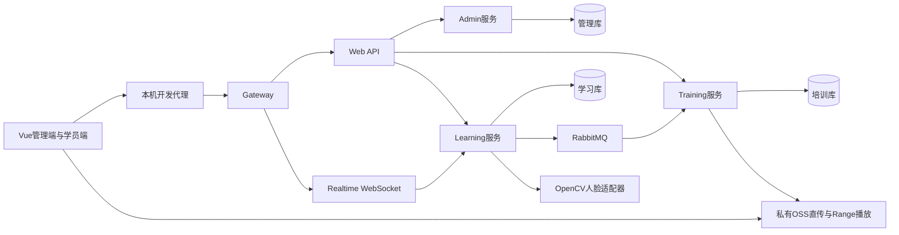
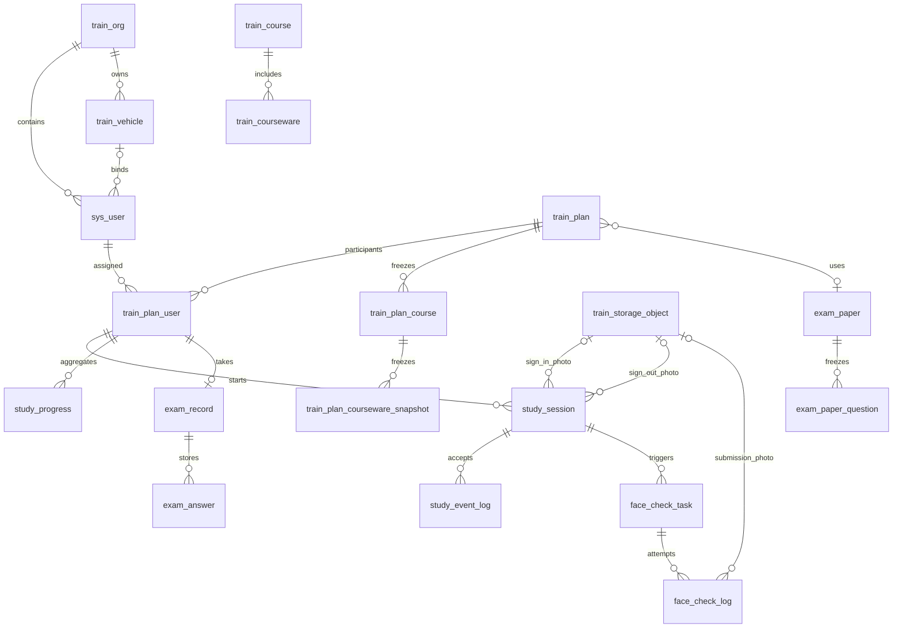
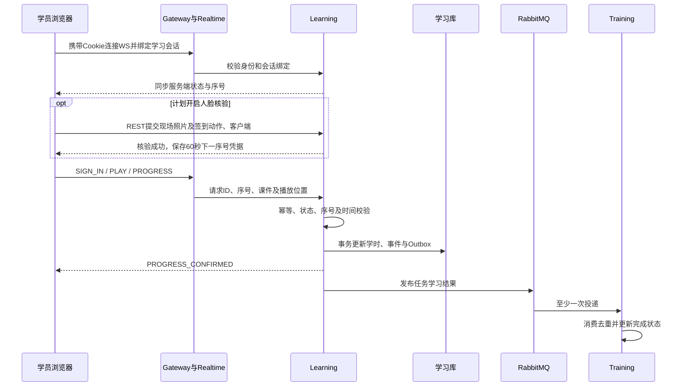
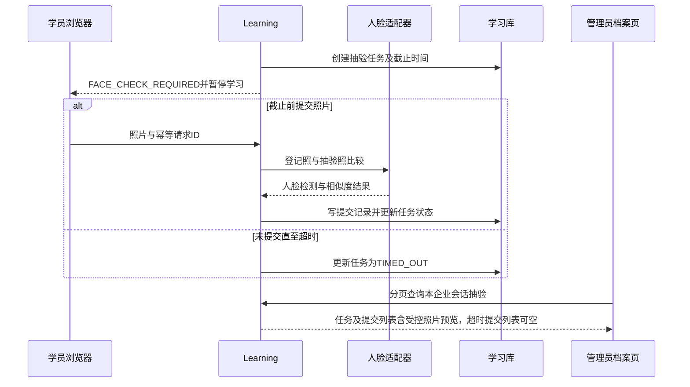

# 论文设计与答辩材料

题目：道路运输企业在线安全培训与学时监管系统的设计与实现。

本文按仓库实际实现组织，可作为论文正文和答辩讲稿的技术底稿。学校格式、作者信息、参考文献规范需按实际要求编排。2026-09-13按工作区（基准`374d762`及未提交改动）静态核对，本次未执行测试或更新Word论文。后续按[变更总索引](../changes/README.md)和[首次回溯记录](../changes/2026-09-13-since-09-07.md)维护增量依据，历史测试不自动覆盖当前实现。

测试结论引用[09-09历史验收报告](../test/acceptance-2026-09-09.md)，[09-07报告](../test/acceptance-2026-09-07.md)保留历史记录；结果只适用于报告所列版本。[约8分钟讲稿](defense-script-8min.md)与[证据索引](evidence-index.md)区分当前实现与历史验证，未验证项目不能改写为已完成实验。

## 摘要素材

针对道路运输企业培训资料、学习时长和考试结果分散的问题，系统将企业基础管理、课程与计划、视频学习、人脸抽验、在线考试和培训档案组织为统一业务流程。后端采用按职责拆分的Java服务，前端提供管理和学员两个工作台。培训计划发布时冻结课程及考试规则，学习服务根据服务端时间与播放位置共同确认有效学时，通过幂等请求、单调序号和状态机处理重复消息与断线恢复，并以Outbox事件将学习结果同步到培训任务。学员可查看已结束计划的档案，管理员可追溯本企业的会话、受理事件和抽验记录。系统同时提供企业车辆与人员绑定、核验照片的受控预览及部署、测试脚本。验证分为领域规则、浏览器接口契约和真实基础设施联调三个层次，结论限于报告已覆盖的条件。

关键词：在线培训；有效学时；状态机；WebSocket；学习档案；企业隔离。

## 1. 需求分析

平台管理员负责建立组织及管理员；企业管理员负责部门、学员、车辆、课程、题库、试卷、计划和统计；学员参加本人被分配的培训并查询学习成果。权限由角色授权与服务端上下文共同决定，前端菜单隐藏不作为数据隔离措施。

培训只有“仅学习”“学习+考试”两种模式，均需至少一门课程和一名学员才能发布。仅学习模式满足规定学习要求后完成；学习+考试必须先完成学习才能开考或继续进行中的考试，结业还须达到考试及格条件，既有已结束考试记录仍可读取。计划保存按自然日将开始时间归一为00:00:00、结束时间归一为23:59:59；至少有一名有效参训人员且全部结业后，计划可提前进入FINISHED。完成学员可在原周期内回看，未开始、到期或取消时禁止播放，历史档案仍可查询。

车辆支持人员可选绑定一辆车，同车可以绑定多人，并可从车辆查看绑定人员；当前未实现年审或营运证流程。个人资料支持本人维护姓名、手机号和登记照。首页“待考试”统计尚未增加学习完成过滤，与实际开考准入存在差异，论文不能将待考试数量解释为可立即开考的任务数。

关键非功能需求是学时可解释、重复请求不重复累计、结束后的记录可追溯、不同企业数据隔离、认证令牌不出现在URL以及私有课件受控访问。目标是可演示且可验证的单实例部署，不宣称高可用集群能力。

## 2. 总体设计

服务之间通过明确泛型的Result RPC接口交互，Web API仅承担鉴权入口和必要聚合。课程和计划属于培训服务，会话、学时与抽验属于学习服务，人员权限和车辆属于管理服务。三个业务库分开管理迁移；跨服务使用逻辑ID关联，不建立跨库外键。

学员档案由Web API先读取本人发布任务，再批量查询当前页学时。详情以课程发布快照为目录，未学习课程补零展示而不创建进度行。查询已结束计划时计算展示状态，不调用计划生命周期刷新或考试开启逻辑。

## 3. 数据库设计

以下为与论文主线有关的逻辑ER图。关联线表示业务关联，不代表跨库数据库外键；完整字段以各服务Flyway迁移为准。

| 数据 | 设计作用 | 关键约束 |
| --- | --- | --- |
| train_plan_course与课件快照 | 防止基础课程后续修改影响历史任务 | 保存名称、时长、学习规则和对象引用 |
| train_plan_user | 独立参训任务及学习/考试/完成状态投影 | 查询必须带企业与用户范围 |
| study_event_log | 追溯已受理消息和本次计时结果 | 幂等键及会话内事件序号 |
| face_check_task / face_check_log | 区分抽验要求与实际提交 | 任务可存在零条提交记录 |
| mq_outbox / mq_consume_log | 学习结果可靠投递与重复消费防护 | 事件标识和处理状态 |
| train_vehicle / sys_user.vehicle_id | 企业车辆台账与人员可选绑定 | 企业内车牌唯一；每人最多一车，同车可多人 |
| study_session核验凭据与照片引用 | 签到签退核验及照片留存 | 限定动作、下一事件序号和60秒；正式事件受理后归档 |
| face_check_log.photo_object_id | 抽验提交私有照片引用 | 历史可空；本人或本企业统计权限预览 |

车辆部门可空，绑定时验证部门属于当前企业且有效。删除部门前检查车辆引用，防止台账悬空。人员新增或换绑必须选择本企业启用车辆，编辑时可保留原已停用车辆或解除绑定。车辆启停保留记录，当前没有车辆删除接口。

本次涉及管理库V14人员车辆绑定、学习库V4签到签退凭据与V5照片引用，以及培训库V6平台个人图片归属可空迁移。学习照片以LEARNING_PHOTO类型保存到私有存储，学习库只保存对象ID，不补造历史照片。ER图分别表示签到、签退两项可空对象引用，属于跨库逻辑关联；本次未执行迁移。

## 4. 学习与有效学时

对于一个有效的学习进度区间，计算器取服务端经过时间、非负播放位置增量、允许的最大间隔与课程剩余规定学时中的最小值。超过最大上报间隔时不补记；禁止拖动时，位置增量超过服务端经过时间加容差会被拒绝。容差用于判断合法范围及课件末尾完成位置，不额外赠送学时。

心跳用于连接保活，不能直接增加学时。重复请求返回已确认结果，旧序号不会作为新进度累计。浏览器断线后立即暂停播放与本地计时入口，重连先同步状态。ACK表示消息受理，最终学时以PROGRESS_CONFIRMED或只读状态查询为准。实时协议业务ID仍为字符串，seq和lastSequence为JSON整数，避免将序号按ID转换。

计算器实验将100秒媒体分成10段，每段媒体位置增加10秒，服务端间隔交替为9秒和11秒，最终计入95秒。这是合成输入下的保守计时差额，不能解释为真实浏览器固定损失5%，也不能声称误差为零。本轮为“全部课件播放完成但学时不足”增加从头补学入口：只重置已完成课件当前位置，保留累计学时与完成标记，再通过正常播放补足。浏览器中的实际差额待真实媒体实验测量。

当前页面分别展示培训总有效学时/规定学时、课程学时和课件确认播放位置，不将播放进度等同于结业；未生成进度的规定学时依据发布快照。播放器切换课件前暂停并等待必要进度确认，载入后依据服务端位置续播。列表汇总不初始化学习进度；学习详情的getPlanProgress仍会调用ensureProgress，与独立只读档案入口不同。首次实时绑定总等待上限30秒，重连不延长；下一课件只在连接和状态允许时尝试自动播放，抽验、断线或页面隐藏会取消自动衔接。上述09-13变化及新增测试仅静态核对，旧截图不能证明当前交互已验收。

Outbox使学习库内进度与待发送事件处于同一事务，培训服务依靠幂等消费维护任务投影。该设计允许短暂最终一致性延迟；不能把单个RPC成功等同于跨库同步完成。

本轮修正Broker确认与路由退回的处理：ACK同时存在NO_ROUTE时不标记SENT。真实RabbitMQ实验先制造独立路由无队列，再补齐临时队列、重建发送器并验证恢复和重复事件ID。实验使用真实Broker与生产发送器，但数据库Mapper为测试替身，不能替代MySQL持久化与业务服务重启实验。本机默认使用HTTP/WS；后续HTTPS部署再验证WSS及浏览器摄像头安全上下文。

## 5. 抽验、考试与历史查询

启用人脸核验的会话，签到签退页面提供摄像头采集并先提交核验；后端接收图片并校验身份，不能仅凭图片请求证明采集来源或活体。服务端校验会话状态、客户端及人脸，并将成功凭据限定为本次动作和下一事件序号，60秒内使用，序号推进后不能复用。对应正式事件受理后才将照片归入会话档案。独立抽验查询接口仍只返回待处理任务；会话状态查询在TERMINATED时附带最近FAILED或TIMED_OUT抽验，否则附带待处理任务，供刷新后恢复提示。不能写成任意抽验查询均返回最近完成结果。

人脸功能依赖已授权登记照与模型。相似度阈值属于配置，不能把“同一张图片比较通过”解释为对现实身份的全面识别准确率。活体检测、对抗照片攻击和复杂光照下的准确率不在当前已验证结论内。

考试在学习完成后进入，采用服务端开始与截止时间、题目快照和服务端判分，客户端保存答案使用序列化请求防止覆盖。档案考试信息仅读取当前保存成绩，不开考。历史查询分层展示任务、课程学时、会话和抽验，已结束计划仍可查。会话返回signInPhotoUrl、signOutPhotoUrl，抽验提交返回photoUrl，均为私有照片短期预览；原图字节、模板和内部幂等响应不进入档案JSON。学员仅访问本人照片，统计管理员仅访问本企业照片，历史无照片返回空值；短期URL不得作为论文永久公开证据链接。

## 6. 实验设计与证据边界

领域单元测试检查有效学时公式、幂等、超时和企业隔离。浏览器ui项目使用确定的契约夹具，覆盖页面筛选、详情、零提交抽验和车辆操作。live项目使用独立演示账号走真实网关与服务，不拦截业务响应。load项目测量单实例已认证WebSocket的1、10、50连接心跳往返，记录成功数、错误数、P50/P95和吞吐。

心跳实验不绑定学习会话、不落学习学时，因此仅能说明对应环境下的连接与协议处理能力。真实学习并发实验还需不同学员、有效课程、私有OSS和完整状态绑定，同时观测数据库及Outbox延迟。不能用模拟心跳结果推导生产容量。

09-09历史结果中，后端适用`fcbb50688adcf1ee1130e6c27af977f69f645d1f`，前端适用`7ca2f9413edda1f6c7159c6f7492d1d152a8eba9`，详见[CI证据](../test/ci-2026-09-09.json)。当时在Docker CI补跑11项数据库条件测试，全部通过；后端全量210项中208项通过，剩余OSS和授权照片模型两项跳过。前端CI完成55项单测、4项媒体条件守卫与5项UI契约测试。数据库测试过程中修正了最小测试上下文的JDBC/Flex事务装配、权限前缀查询和Nacos隔离；失败与成功作业均在报告中保留。这些数字不代表09-13工作区通过；本次未执行新增测试、真实摄像头或媒体闭环。

新增media项目覆盖真实上传、Range解码、两种完成模式、抽验、考试与恢复，study-load项目按1、5、10名独立学员各观察60秒正常播放。每组记录实际播放位置增量、解码帧数、有效学时差额、事件响应P50/P95和任务开始状态可见时间；状态可见时间包含查询与应用开销，不等于Broker内部投递延迟。脚本拒绝复用已有学时的样本，显式启用但配置缺失时失败。上述两项目当前未执行，数值须来自后续实际生成的JSON报告。

## 7. 答辩演示讲稿（约8分钟）

| 时间 | 展示内容 | 讲述重点 |
| --- | --- | --- |
| 0:00–1:00 | 需求与系统架构 | 培训记录分散，目标是可追溯的学时与结果 |
| 1:00–2:00 | 企业车辆、部门、学员 | 本企业隔离、可选车辆绑定、启停保留历史 |
| 2:00–3:00 | 课程、两种计划模式 | 自然日周期、先学后考、全员提前结业与周期内回看 |
| 3:00–4:30 | 学员学习及暂停恢复 | 服务端确认学时，心跳本身不计时 |
| 4:30–5:30 | 签到签退、抽验与考试 | 摄像头核验、60秒凭据；截止、重试和判分由服务端决定 |
| 5:30–6:30 | 学习档案、管理会话详情 | 结束后可查；受控照片预览与零提交超时记录 |
| 6:30–7:30 | 测试与性能结果 | 区分真实、模拟及条件不足的项目 |
| 7:30–8:00 | 局限及后续工作 | 优先真实媒体闭环与本机证据；TLS和集群后置 |

演示环境缺少OSS时，展示已验证的车辆、首页及接口流程；媒体与历史夹具截图必须明确说明是契约测试数据，不能伪装为真实培训成绩。

## 8. 常见答辩问题

**为什么不使用浏览器播放时长直接累计？** 浏览器时间与播放位置由客户端提供，可能因拖动、倍速、断线或重复上报失真。服务端对经过时间和位置增量取保守值，再进行状态及幂等校验。

**为什么拆分任务与学习进度？** 培训服务维护业务任务、规则与完成状态，学习服务处理高频进度和事件。Outbox同步使职责分离，但需要接受并说明短暂状态同步延迟。

**档案查询为什么单独实现？** 原学习入口可能检查计划有效期并初始化进度。档案需长期可查且不得改变业务状态，使用独立只读接口可明确这一边界。

**为什么抽验任务不能只查询提交表？** 从未提交照片的超时抽验没有提交行，以提交表为主会漏掉这类监管记录。

**如何证明企业隔离？** 服务端从登录上下文取enterpriseId，每次对象访问重新验证归属，真实验收用另一演示企业尝试修改同一车辆并验证被拒绝。客户端传参不能决定查询企业。

**后续优先工作是什么？** 先完成有授权媒体的本机真实闭环、异常及持久化恢复实验，再整理论文证据；远程TLS部署、多实例实时会话协调与行管跨企业查询后置，后者还需独立授权模型。

## 图文与代码对应

| 图文 | 实现位置（相对仓库根目录） |
| --- | --- |
| 架构与边界 | backend/pom.xml、各应用模块 |
| ER与迁移 | 各业务服务src/main/resources/db/migration |
| 有效学时 | train-learning-service/.../LearningTimeCalculator.java |
| 学习状态机 | train-learning-service/.../LearningSessionServiceImpl.java |
| 抽验与签到签退核验 | train-learning-service/.../FaceCheckServiceImpl.java |
| 自然日、全员结业与回看 | train-training-service/.../PlanServiceImpl.java、PlanLifecycleService.java、LearningAccessServiceImpl.java |
| 学习照片留存与预览 | train-training-service/.../PrivateImageStorageServiceImpl.java、train-learning-service/.../LearningRecordServiceImpl.java |
| 档案聚合 | train-web-api/.../TrainingRecordController.java |
| 企业车辆 | train-admin-service/.../VehicleServiceImpl.java |
| 截图 | output/playwright（文件名含ui-fixture的为模拟数据） |

截图与运行日志默认不提交。公开材料仅包含虚构账号展示名、非敏感业务字段及统计结果，不包含演示密码或认证会话。
